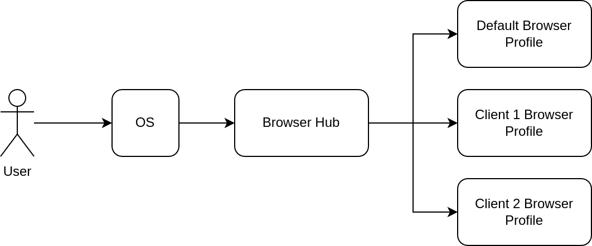

> [!NOTE]  
> Este programa se ha probado en Ubuntu 22.04 y [Omarchy](https://omarchy.org/) con el navegador Chrome, pero el mismo concepto se aplica a otros sistemas operativos y navegadores.

## Problema

Como consultores, generalmente trabajamos con múltiples clientes. Separar el trabajo no es difícil hasta que comienzas a usar el navegador. Por ejemplo, podría que tengan diferentes cuentas de Google/Outlook. Añade tu cuenta personal a la ecuación y rápidamente se convierte en un lío difícil de manejar en el mismo navegador. Otra cuestión son las extensiones del navegador. Imagina que tú y todos tus clientes usan la extensión [Toggl](https://toggl.com/) para registrar el tiempo, y deberías usar una cuenta diferente para cada uno.

Podrías usar múltiples perfiles en Chrome y Firefox. Pero existe otro problema. Digamos que haces clic en un enlace desde fuera del navegador (por ejemplo, VSCode). ¿En qué perfil debería abrirse?

## Solución

La solución es un programa que reemplaza al navegador predeterminado. Luego decide qué instancia del navegador abrir basándose en el dominio o una palabra clave en la URL.



Esto es un buen comienzo, pero no es suficiente. Al menos en Chrome, las clases de ventana (`wm_class` en xorg) de las diferentes instancias de perfiles son iguales. Por lo tanto, incluso si abres una ventana separada para cada perfil, todas se agrupan juntas. Se vuelve cada vez más difícil distinguirlas al cambiar de ventana.

La pieza final es usar un directorio de usuario separado en Chrome (vía `--user-data-dir`). De esta manera, Chrome crea una clase de ventana diferente para cada perfil. Podemos mejorarlo aún más creando un lanzador y un icono dedicados. Aquí hay un ejemplo de archivo `.desktop`:

```
[Desktop Entry]
Version=1.1
Type=Application
Name=Chrome - Client1
Comment=Browser profile for Client1
Icon=/home/amir/Documents/Icons/web-browser-yellow.svg
Exec=google-chrome --user-data-dir=/home/amir/.config/google-chrome/Client1 %U
Categories=Network;
StartupWMClass=google-chrome (/home/amir/.config/google-chrome/Client1)
```

Especificar `StartupWMClass` permite al lanzador saber qué perfil está abierto actualmente. Por ejemplo, cuando abro el navegador predeterminado y el del cliente-1, el lanzador muestra esto:


## Instalación

1. Instalar Browser Hub: `cargo install browser-hub`
2. [Configurarlo](#configuration)
3. Establecer Browser Hub como tu navegador predeterminado

Para probarlo, puedes ejecutar Browser Hub en tu terminal:

```
browser-hub {url}
```

## Configuración

Crea la carpeta de configuración:

```
mkdir -p ~/.config/browser-hub
```

Crea el archivo `config.json`. Aquí hay un ejemplo para Chrome:

```json
{
  "default_browser_open_cmd": "google-chrome {url}",
  "profiles": [
    {
      "name": "Client1",
      "url_patterns": ["client1-domain1", "client1-domain2"],
      "browser": {
        "open_cmd": "google-chrome --user-data-dir=/home/amir/.config/google-chrome/Client1 \"{url}\"",
        "process_names": ["chrome"],
        "cmd_includes_regex": "--user-data-dir=.+google-chrome/Client1",
        "cmd_excludes_regex": "--type=renderer"
      },
      "url_transformers": [
        {
          "keywords": ["/client1-org1", "/client1-org2", "/client1-org3"],
          "from_url_regex": "http(s)?://(.*\\.)?github.com",
          "to_url": "https://ghe.client1-on-prem.com"
        }
      ]
    },
    {
      "name": "Client2",
      "url_patterns": ["client2-domain"],
      "browser": {
        "open_cmd": "google-chrome --user-data-dir=/home/amir/.config/google-chrome/Client2 \"{url}\"",
        "process_names": ["chrome"],
        "cmd_includes_regex": "--user-data-dir=.+google-chrome/Client1",
        "cmd_excludes_regex": "--type=renderer"
      },
      "url_transformers": []
    }
  ],
  "profile_specific_urls": [
    "amazon.com",
    "github.com",
    ".google.com",
    "datadoghq.com",
    "sentry.io",
    "lucid.app"
  ]
}
```

Algunos ejemplos basados en esta configuración:

| URL de origen                           | URL de destino                                           | Perfil                                                    |
| --------------------------------------- | -------------------------------------------------------- | --------------------------------------------------------- |
| https://www.client1-domain1.com         | Igual                                                    | Cliente 1                                                 |
| https://www.client2-domain.com          | Igual                                                    | Cliente 2                                                 |
| https://console.amazon.com              | Igual                                                    | Perfil activo basado en el proceso en ejecución           |
| https://github.com/client1-org1/repo1   | https://ghe.client1-on-prem.com/client1-org1/repo1       | Cliente 1                                                 |
| https://news.ycombinator.com/           | Igual                                                    | Perfil predeterminado de Chrome                           |

### Ejemplo de configuración para Firefox

Primero debes crear perfiles de Firefox (en este ejemplo: `client-1`, `client-2`), luego usa el siguiente ejemplo de configuración:

```json
{
  "default_browser_open_cmd": "firefox {url}",
  "profiles": [
    {
      "name": "Client 1",
      "browser": {
        "open_cmd": "firefox -P client-1 --class client-1 \"{url}\"",
        "process_names": ["firefox"],
        "cmd_includes_regex": "-P client-1"
      },
      "url_patterns": ["client1-domain1", "client1-domain2"]
    },
    {
      "name": "Client 2",
      "browser": {
        "open_cmd": "firefox -P client-2 --class client-2 \"{url}\"",
        "process_names": ["firefox"],
        "cmd_includes_regex": "-P client-2"
      },
      "url_patterns": ["client2-domain1", "client2-domain2"]
    }
  ],
  "profile_specific_urls": [
    "amazon.com",
    "github.com",
    ".google.com",
    "datadoghq.com",
    "sentry.io"
  ]
}
```

### Opciones

- `default_browser_open_cmd`: El comando de shell para ejecutar el navegador predeterminado cuando ningún perfil coincide con la URL abierta. Normalmente debe configurarse con tu perfil personal.
- `profiles`: [Array] Perfiles de tus clientes.
  - `name`: Nombre del perfil.
  - `url_patterns`: [Array] Este perfil se abrirá si la URL contiene alguno de estos patrones. Por lo general, se establece en los dominios específicos del cliente.
  - `browser`: Información del navegador específica para este perfil.
    - `open_cmd`: El comando de shell para abrir el navegador de este perfil de cliente.
    - `process_names`: [Array] Nombre del proceso del navegador utilizado para determinar si un perfil está activo.
    - `cmd_includes_regex`: Una expresión regular para distinguir los procesos del navegador de este perfil.
    - `cmd_excludes_regex`: Los procesos cuya línea de comando coincida con esta expresión regular serán ignorados. Útil para excluir el proceso del navegador cuando se ejecuta en segundo plano.
  - `url_transformers`: [Array] Transformar una URL en otra. Por ejemplo, mapear acciones de GitHub a la instancia local de GitHub para empresas.
    - `keywords`: [Array] Palabras clave que activan el transformador si se encuentran en la URL.
    - `from_url_regex`: Expresión regular de coincidencia que especifica qué reemplazar en la URL (grupos de regex).
    - `to_url`: La URL será reemplazada por esta cadena. Las retroreferencias, como `\6`, se reemplazan con la subcadena coincidente por el grupo 6 en `from_url_regex`.
- `profile_specific_urls`: [Array] Si la URL contiene alguno de los elementos especificados en este campo, Browser Hub verificará si se está ejecutando algún navegador específico de perfil y abrirá la URL en esa instancia del navegador. Si hay más de un perfil en ejecución, se seleccionará uno de ellos de forma aleatoria (generalmente el que se ejecutó primero). Esto es útil para casos en los que no podemos reconocer el perfil a partir de la URL (por ejemplo, Google Docs).
