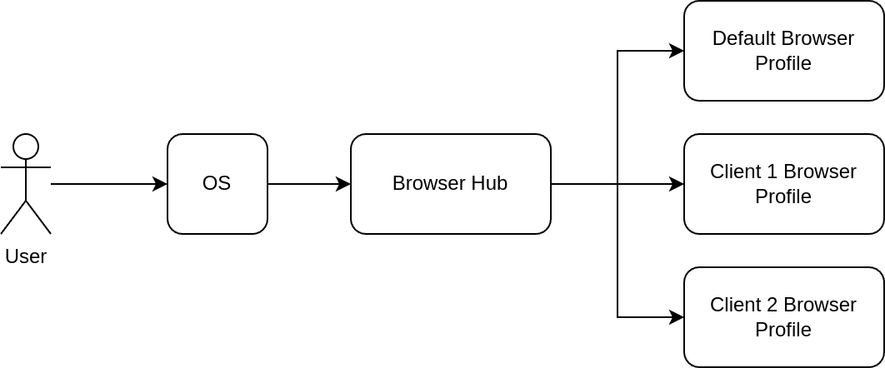

> [!NOTE]  
> This program is tested on Ubuntu 22.04 and mainly Chrome but same concept
> applies to other OSes and browsers.

## Problem

As consultants, we usually work with multiple clients. Separating the work isn't
difficult until you start using the browser. For example, they might have
different Google/Outlook accounts. Add to that your personal account, and it
quickly becomes a mess to handle in the same browser. Another thing is the
browser extensions. Imagine you and all your clients are using
[Toggl](https://toggl.com/) extension to track the time, and you should use a
different account for each.

You would be able to use multiple profiles in Chrome and Firefox. But there's
another problem. Let's say you click on a link from outside the browser (e.g.,
VSCode). In which profile should it be opened?

## Solution

The solution is a program that replaces the default browser. It then decides
which browser instance to open based on the domain or a keyword in the URL.



This is a good start but not enough. At least in Chrome, the window classes
(`wm_class` in xorg) of different profile instances are the same. So, even if
you open a separate window for each profile, they are all grouped together. It
becomes harder and harder to distinguish them when switching windows.

The final piece is using separate user directory in Chrome (via
`--user-data-dir`). This way Chrome creates a different window class for each
profile. We can enhance it further by creating a dedicated launcher and icon.
Here is an example `.desktop` file:

```
[Desktop Entry]
Version=1.1
Type=Application
Name=Chrome - Client1
Comment=Browser profile for Client1
Icon=/home/amir/Documents/Icons/web-browser-yellow.svg
Exec=google-chrome --user-data-dir=/home/amir/.config/google-chrome/Client1 %U
Categories=Network;
StartupWMClass=google-chrome (/home/amir/.config/google-chrome/Client1)
```

Specifying `StartupWMClass` lets the launcher know which profile is currently
open. For example, when I open the default and the client-1's browser, the
launcher shows this:


## Install

1. Install Browser Hub: `pipx install browser-hub`
2. [Configure](#configuration) it
3. Set Browser Hub as your default browser

To test it, you can run Browser Hub in your terminal:

```
browser-hub {url}
```

## Configuration

Create the config folder:

```
mkdir -p ~/.config/browser-hub
```

Create `config.json` file. Here's an example for Chrome:

```json
{
  "default_browser_open_cmd": "google-chrome {url}",
  "profiles": [
    {
      "name": "Client1",
      "url_patterns": ["client1-domain1", "client1-domain2"],
      "browser": {
        "open_cmd": "google-chrome --user-data-dir=/home/amir/.config/google-chrome/Client1 \"{url}\"",
        "process_names": ["chrome"],
        "cmd_includes_regex": "--user-data-dir=.+google-chrome/Client1",
        "cmd_excludes_regex": "--type=renderer"
      },
      "url_transformers": [
        {
          "keywords": ["/client1-org1", "/client1-org2", "/client1-org3"],
          "from_url_regex": "http(s)?://(.*\\.)?github.com",
          "to_url": "https://ghe.client1-on-prem.com"
        }
      ]
    },
    {
      "name": "Client2",
      "url_patterns": ["client2-domain"],
      "browser": {
        "open_cmd": "google-chrome --user-data-dir=/home/amir/.config/google-chrome/Client2 \"{url}\"",
        "process_names": ["chrome"],
        "cmd_includes_regex": "--user-data-dir=.+google-chrome/Client1",
        "cmd_excludes_regex": "--type=renderer"
      },
      "url_transformers": []
    }
  ],
  "profile_specific_urls": [
    "amazon.com",
    "github.com",
    ".google.com",
    "datadoghq.com",
    "sentry.io",
    "lucid.app"
  ]
}
```

A few examples based on this config:

| Source URL                            | Target URL                                         | Profile                                     |
| ------------------------------------- | -------------------------------------------------- | ------------------------------------------- |
| https://www.client1-domain1.com       | Same                                               | Client 1                                    |
| https://www.client2-domain.com        | Same                                               | Client 2                                    |
| https://console.amazon.com            | Same                                               | Active Profile based on the running process |
| https://github.com/client1-org1/repo1 | https://ghe.client1-on-prem.com/client1-org1/repo1 | Client 1                                    |
| https://news.ycombinator.com/         | Same                                               | Default Chrome Profile                      |

### Firefox Config Example

You first need to create firefox profiles (in this example: `client-1`,
`client-2`), then use the following config example:

```json
{
  "default_browser_open_cmd": "firefox {url}",
  "profiles": [
    {
      "name": "Client 1",
      "browser": {
        "open_cmd": "firefox -P client-1 --class client-1 \"{url}\"",
        "process_names": ["firefox"],
        "cmd_includes_regex": "-P client-1"
      },
      "url_patterns": ["client1-domain1", "client1-domain2"]
    },
    {
      "name": "Client 2",
      "browser": {
        "open_cmd": "firefox -P client-2 --class client-2 \"{url}\"",
        "process_names": ["firefox"],
        "cmd_includes_regex": "-P client-2"
      },
      "url_patterns": ["client2-domain1", "client2-domain2"]
    }
  ],
  "profile_specific_urls": [
    "amazon.com",
    "github.com",
    ".google.com",
    "datadoghq.com",
    "sentry.io"
  ]
}
```

### Options

- `default_browser_open_cmd`: The shell command to run the default browser when
  no profile is matching the opened URL. Normally it should be set to your
  personal profile.
- `profiles`: [Array] Profiles of your clients.
  - `name`: Name of the profile.
  - `url_patterns`: [Array] This profile will be opened if the URL contains any
    of these patterns. Usually set to the client-specific domains.
  - `browser`: Browser information specific to this profile.
    - `open_cmd`: The shell command to open this client profile browser.
    - `process_names`: [Array] Name of the browser process used to determine
      whether a profile is active.
    - `cmd_includes_regex`: A regular expression to distinguish this profile
      browser processes.
    - `cmd_excludes_regex`: The processes with a command line that matches this
      regular expression will be ignored. Useful to exclude the browser process
      when running in the background.
  - `url_transformers`: [Array] Transforming a URL to another one. e.g. Mapping
    GitHub actions to the enterprise on-prem GitHub instance.
    - `keywords`: [Array] Keywords that trigger the transformer if found in the
      URL.
    - `from_url_regex`: Matching regular expression that specifies what to
      replace in the URL (regex groups).
    - `to_url`: The URL will be replaced by this string. Backreferences, such as
      `\6`, are replaced with the substring matched by group 6 in the
      `from_url_regex`.
- `profile_specific_urls`: [Array] If the URL contains any of the specified
  items in this field, Browser Hub will check whether any profile-specific
  browser is running, and open the URL in that browser instance. If more than
  one profile are running, one of them will be selected randomly (usually the
  one that was run first). This is useful for cases where we can't recognize the
  profile from the URL (e.g. Google Docs).
